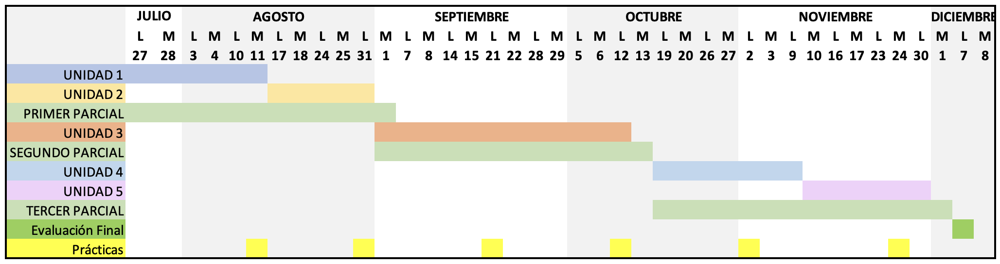

# PLAN DE ASIGNATURA

## INF 662 — DESARROLLO DE APLICACIONES MÓVILES

**Marco referencial:** El programa docente del proceso de enseñanza-aprendizaje se encuentra estructurado en correspondencia con los lineamientos del modelo académico. La asignatura contribuye al fortalecimiento de la familia laboral "Ingeniería de Software", así como al perfil definido en el proyecto curricular.

La materia "Desarrollo de Aplicaciones Móviles" tiene como propósito la formación en el diseño y construcción de aplicaciones para dispositivos móviles, integrando el lenguaje de programación Dart con el SDK de Flutter conforme a los estándares de la industria del software. Se busca que el estudiante adquiera competencias en la construcción de interfaces de usuario, la gestión del estado, la navegación entre pantallas, la programación asíncrona y la persistencia de datos, así como en la aplicación de buenas prácticas de desarrollo multiplataforma. Para ello, se abordan fundamentos de configuración del entorno, manejo de widgets, interactividad, el patrón de manejo de estado con Provider y el acceso a bases de datos locales mediante SQLite, con el fin de producir aplicaciones móviles innovadoras, eficientes, funcionales y adaptadas a diversos contextos educativos, empresariales y profesionales.

---

## I. IDENTIFICACIÓN DE LA ASIGNATURA

| Campo | Detalle | Campo | Detalle |
|---|---|---|---|
| **Facultad:** | Ciencias Puras | **Carrera:** | Ingeniería Informática |
| **Asignatura:** | Desarrollo de Aplicaciones Móviles | **Sigla y código:** | INF 662 |
| **Pre-Requisito:** | INF 560 | **Total de horas:** | 5 horas/semana |
| **Trabajo Independiente semanal:** | 5 horas | **Número de créditos:** | 5 |
| **Horas teóricas:**   **Horas prácticas:**   **Horas laboratorio:** | 0   0   5 | **Semestre:** | Sexto Semestre   (Mención Ingeniería de Software) |
| **Docente:** | M. Sc. Huáscar Fedor Gonzales Guzmán | **Email:** | huascar.fedor@gmail.com |

---

## II. FUNDAMENTACIÓN Y JUSTIFICACIÓN

La asignatura Desarrollo de Aplicaciones Móviles se fundamenta en la creciente relevancia de los dispositivos móviles dentro del mercado tecnológico, cuyo uso ha superado al de los ordenadores tradicionales. Al haberse convertido las aplicaciones móviles en la principal interfaz de acceso a internet y a los servicios en línea, la capacidad para diseñarlas y construirlas se ha vuelto una habilidad altamente demandada, lo que hace imprescindible su enseñanza en la formación de los futuros ingenieros informáticos.

El propósito de la asignatura es proporcionar a los estudiantes las bases conceptuales y prácticas que les permitan desenvolverse en un entorno de rápida innovación tecnológica, en el que la evolución constante de la tecnología móvil plantea retos particulares en el diseño de interfaces de usuario, la optimización del rendimiento y el uso de sensores y datos en tiempo real. Por su carácter interdisciplinario, la materia articula conocimientos de diseño de interfaces, programación, sistemas operativos y seguridad informática, ofreciendo una educación integral y versátil orientada a la solución de problemas y al diseño de soluciones centradas en el usuario, capaces de satisfacer sus necesidades específicas de manera efectiva y eficiente.

De esta manera, la asignatura se convierte en un espacio formativo clave que, además de fortalecer las competencias técnicas, fomenta el emprendimiento y la creación de valor, al habilitar a los estudiantes para desarrollar sus propios productos y servicios e impulsar nuevas empresas tecnológicas. Incorporar esta materia en la carrera de Ingeniería Informática asegura que los profesionales estén equipados con las habilidades y los conocimientos necesarios para contribuir significativamente al campo tecnológico y a la sociedad en general.

---

## III. PROPÓSITO

- Formar profesionales integrales con principios éticos y un proyecto de vida sólido.
- Dotar a los estudiantes de competencias académicas y profesionales que les permitan desarrollarse de manera eficiente, responsable y con compromiso social.
- Desarrollar habilidades y destrezas para la resolución de problemas propios de su área de conocimiento y para la toma de decisiones fundamentadas.
- Fomentar la competencia investigativa y la capacidad de análisis crítico para contribuir a la solución de problemas y necesidades de su contexto.
- Estimular la creatividad y la innovación en el diseño de aplicaciones móviles multiplataforma.
- Promover el aprendizaje autónomo y el uso responsable de tecnologías digitales para el desarrollo de soluciones móviles.
- Fomentar la colaboración y el trabajo en equipo en proyectos de desarrollo de aplicaciones móviles.

---

## IV. COMPETENCIAS DE LA ASIGNATURA

### 4.1. Competencia Global de la Asignatura

Diseña, desarrolla y evalúa aplicaciones para dispositivos móviles aplicando el lenguaje de programación Dart y el SDK de Flutter, integrando aspectos técnicos y de diseño para producir soluciones multiplataforma funcionales, eficientes y orientadas a las necesidades del usuario, conforme a los estándares de la industria del software y fomentando la innovación, la usabilidad y la calidad de la experiencia en diversos contextos.

### 4.2. Competencias Específicas de la Asignatura

- Comprende y aplica los fundamentos del lenguaje Dart y la configuración del entorno de Flutter para estructurar la lógica de aplicaciones móviles multiplataforma.
- Diseña y construye interfaces de usuario mediante widgets, aplicando principios de composición, navegación entre pantallas y diseño centrado en el usuario.
- Implementa la gestión del estado y la interactividad de la aplicación, incorporando el manejo de gestos, widgets de entrada y el patrón de manejo de estado con Provider.
- Integra programación asíncrona y persistencia de datos mediante SQLite, asegurando el manejo eficiente de memoria local y la coherencia de la información.
- Analiza y resuelve problemas propios del desarrollo móvil, aplicando pensamiento lógico y buenas prácticas para optimizar el rendimiento de las soluciones.
- Evalúa la funcionalidad, la usabilidad y la calidad de las aplicaciones desarrolladas, identificando oportunidades de mejora conforme a los estándares de la industria.
- Aplica buenas prácticas de trabajo colaborativo en proyectos de desarrollo de aplicaciones móviles, considerando aspectos éticos, responsables y de gestión de recursos.

---

## V. DESARROLLO DE SABERES DE LA ASIGNATURA

| Saber conocer | Saber hacer | Saber ser |
|---|---|---|
| - Conoce los fundamentos del lenguaje Dart y la arquitectura del SDK de Flutter aplicables al desarrollo de aplicaciones móviles multiplataforma. - Conoce los principios de construcción de interfaces mediante widgets, la navegación entre pantallas y los mecanismos de gestión del estado (incluido Provider). - Conoce los fundamentos de la programación asíncrona y la persistencia de datos con SQLite, así como los elementos de calidad, usabilidad y experiencia de usuario en aplicaciones móviles. | - Configura el entorno de desarrollo y aplica la lógica de programación en Dart para estructurar aplicaciones móviles. - Diseña y construye interfaces de usuario funcionales e interactivas, gestionando el estado y la navegación de la aplicación. - Implementa programación asíncrona y acceso a bases de datos locales, y evalúa la funcionalidad y usabilidad de las aplicaciones identificando oportunidades de mejora. | - Creativo e innovador en la generación de soluciones móviles. - Analítico y resolutivo en la identificación de problemas y la optimización del rendimiento de las aplicaciones. - Colaborativo y proactivo en el trabajo en equipo. - Responsable y ético en el uso de tecnologías digitales. - Capacidad de planificación y organización en el desarrollo de proyectos. |

---

## VI. CONTENIDOS TEMÁTICOS DE LA ASIGNATURA

### UNIDAD 1: FUNDAMENTOS Y CONFIGURACIÓN DEL ENTORNO

- Introducción
- Programación con el lenguaje Dart
- Configuración del entorno de desarrollo en Windows
- Ejercicio: crea y ejecuta una aplicación Flutter simple

### UNIDAD 2: EXPLORANDO WIDGETS Y NAVEGACIÓN

- Widgets
- Catálogo de Widgets básicos
- Navegación
- Ejercicio: UI para una aplicación de lista de planes

### UNIDAD 3: GESTIÓN DEL ESTADO E INTERACTIVIDAD

- Gestión del estado
- Manejo de gestos del usuario
- Widgets de entrada
- Ejercicio: hacer interactiva la aplicación de lista de planes

### UNIDAD 4: MANEJO DEL ESTADO CON PROVIDER

- Manejo del estado con Provider
- Ejercicio: empleo de Provider en la aplicación de lista de planes

### UNIDAD 5: PROGRAMACIÓN ASÍNCRONA E INTERACCIÓN CON SQLITE

- Dart asíncrono
- Bases de datos
- El paquete sqflite de Flutter
- Ejercicio: manejo de memoria persistente en la aplicación de lista de planes

---

## VII. MÉTODOS Y ESTRATEGIAS DE ENSEÑANZA-APRENDIZAJE

Se utilizan métodos y estrategias de enseñanza y aprendizaje de acuerdo con el avance de la ciencia y la tecnología educativa y las necesidades de desarrollo de habilidades y destrezas.

- Explicativo ilustrativo
- Aprendizaje participativo
- Método problémico
- Método expositivo
- Simulación de casos
- Método investigativo
- Lluvia de ideas
- Aprendizaje por proyectos

### RECURSOS

- Computadora
- Data display
- Pizarra
- Texto base
- Guías de laboratorio
- Internet
- Plataforma de aprendizaje en línea, oficial de la UATF o Carrera
- Herramienta de comunicación virtual sincrónica (Meet)

### RECURSOS DE LABORATORIO

- Visual Studio Code
- Postman
- Flutter SDK
- Android Studio

---

## VIII. SISTEMA DE EVALUACIÓN

### Criterios de Evaluación — Asignatura de Laboratorio

| Componente | Ponderación |
|---|---|
| Exámenes parciales | 30% |
| Prácticas | 10% |
| Laboratorio | 30% |
| Examen final | 30% |
| **Total** | **100%** |

| Tipo de evaluación | Técnica | Instrumento | Evidencia | Entorno |
|---|---|---|---|---|
| **Diagnóstica** | Interrogatorio (presencial y/o virtual) | Guía de observación (presencial y/o virtual) | Cuestionario resuelto (presencial y/o virtual) | Aula (presencial y/o virtual) |
| **Formativa** | Desempeño (presencial y/o virtual) | Prueba escrita (presencial y/o virtual) | Presentación, exposición (presencial y/o virtual) | Aula (presencial y/o virtual) |
| **Sumativa / Producto** | Enunciado, ejercicios (presencial y/o virtual) | Prueba escrita (presencial y/o virtual) | Presentación de trabajo final (presencial y/o virtual) | Aula (presencial y/o virtual) |

---

## IX. BIBLIOGRAFÍA

- Alessandria, S., & Kayfitz, B. (2021). *Flutter cookbook: Over 100 Proven Techniques and Solutions for App Development with Flutter 2.2 and Dart* (First Edition). Packt Publishing Limited.
- Alessandria, S. (2020). *Flutter Projects: A Practical, Project-Based Guide to Building Real-World Cross-Platform Mobile Applications and Games*. Packt Publishing Ltd.
- Arshad, W. (2021). *Managing State in Flutter Pragmatically: Discover How to Adopt the State Management Approach for Scaling Your Flutter App* (First Edition). Packt Publishing.
- Bailey, T., & Biessek, A. (2021). *Flutter for Beginners: An Introductory Guide to Building Cross-Platform Mobile Applications with Flutter 2.5 and Dart* (Second Edition). Packt Publishing Limited.
- Carew, D. (2024). *DartPad*. https://github.com/dart-lang/dart-pad
- Cheng, F. (2019). *Flutter Recipes: Mobile Development Solutions for iOS and Android*. Apress.
- Freitas, E. (2019). *Flutter Succinctly*. Syncfusion, Inc. www.syncfusion.com
- Google. (2024). *Dart Documentation*. https://dart.dev/guides
- Google. (2024). *Flutter Documentation*. https://docs.flutter.dev/
- Katz, M., Moore, K. D., Ngo, V., & Guzzi, V. (2021). *Flutter Apprentice: Learn to Build Cross-Platform Apps* (Second Edition). Razeware LLC.
- Napoli, M. (2020). *Beginning Flutter: A Hands-On Guide to App Development*. John Wiley & Sons, Inc.
- Payne, R. (2019). *Beginning App Development with Flutter: Create Cross-Platform Mobile Apps*. Springer. https://doi.org/10.1007/978-1-4842-5181-2
- Windmill, E. (2020). *Flutter in Action*. Manning Publications Co.
- Zaccagnino, C. (2020). *Programming Flutter: Native, Cross-Platform Apps the Easy Way* (First Edition). The Pragmatic Programmers, LLC.

---

## X. CRONOGRAMA

